# 🚀 專案模板系統 (Project Template System) v1.3.1

一個革命性的 AI 驅動開發框架，整合九大專業 Agent 和 SuperClaude 全域配置，從架構設計到部署運維的完整解決方案。

<p align="center">
  
  
  
  
</p>

## 🌟 核心特色

- **🤖 九大專業 Agent**：從架構到部署的全方位 AI 助手
- **⚡ SuperClaude 全域配置**：高級 Token 管理、中文優化、認知原型系統
- **📋 智能規劃系統**：自動將需求轉化為可執行任務
- **🎯 精準執行引擎**：逐步實現每個開發任務
- **🔍 自動化品質保證**：內建測試和安全掃描
- **📚 智能文檔生成**：保持文檔與代碼同步
- **🚀 一鍵部署配置**：從開發到生產的完整 DevOps
- **🔧 三種配置模式**：標準、SuperClaude、合併配置靈活選擇

## 📊 九大 Agent 系統

```mermaid
graph TD
    A[需求] --> B[Steering Architect<br/>架構設計]
    A --> C[Strategic Planner<br/>需求規劃]
    C --> D[Task Executor<br/>任務執行]
    D --> E[Dev Agents<br/>專業開發]
    E --> F[QA Agent<br/>品質保證]
    F --> G[DevOps Agent<br/>部署運維]
    E --> H[Documentation<br/>文檔管理]
```



| Agent | 職責 | 主要輸出 |
|-------|------|----------|
| 🏗️ Steering Architect | 專案架構設計與分析 | .ai-rules/ 架構文檔 |
| 📋 Strategic Planner | 需求分析與任務規劃 | specs/ 功能規格 |
| ✅ Task Executor | 精確執行開發任務 | 代碼實現 |
| 📱 Flutter Developer | Flutter 應用開發 | Dart/Flutter 代碼 |
| 🌐 Web Developer | Web 應用開發 | JavaScript/TypeScript 代碼 |
| 🔧 Base Developer | 通用程式開發 | 多語言支援 |
| 🧪 Quality Assurance | 自動化測試 | 測試套件與報告 |
| 🚀 DevOps Agent | CI/CD 與部署 | Docker/K8s 配置 |
| 📚 Documentation | 文檔生成與維護 | 技術文檔/API 文檔 |

## 🚀 快速開始

### 30 秒上手

```bash
# 1. 克隆倉庫
git clone https://github.com/your-username/project-template-system.git
cd project-template-system

# 2. 創建新專案（跨平台 Python 版本）
python tools/init-project.py    # Windows
python3 tools/init-project.py   # Linux/macOS

# 3. 選擇專案類型和 Agent 配置
# 4. 選擇配置類型（標準/SuperClaude v3/合併）
# 5. 開始開發！
```

### 不同平台執行方式

**Windows**:
```cmd
# 方法一：Python（推薦）
python tools\init-project.py

# 方法二：批次檔
tools\init-project.bat
```

**Linux/macOS**:
```bash
# 方法一：Python（推薦）
python3 tools/init-project.py

# 方法二：Shell 腳本
./tools/init-project.sh
```

### 🌟 SuperClaude 配置特色

選擇 SuperClaude 配置可享受：
- **🧠 Advanced Token Economy**: 智能 token 優化
- **⚡ UltraCompressed Mode**: 高效壓縮輸出
- **🌐 中文優化**: 完整的中文開發支援
- **🎭 認知原型系統**: 多種 AI 人格模式
- **⏰ 時間意識同步**: 自動時間檢查機制

### 分析現有專案

**跨平台 Python 版本**：
```bash
# 分析並配置現有專案
python tools/analyze-project.py /path/to/your/project

# 或使用原生腳本
./tools/analyze-project.sh /path/to/your/project  # Linux/macOS
tools\analyze-project.bat C:\path\to\project       # Windows
```

**分析功能**：
- 自動檢測程式語言和框架
- 分析專案結構和依賴
- 計算代碼指標
- 生成 CLAUDE.md 配置
- 輸出詳細分析報告

詳細教學請參考 [快速開始指南](docs/QUICK_START.md)

## 📁 系統結構

```
project-template-system/
├── templates/                    # 專案模板
│   ├── CLAUDE.md.template       # 標準 AI 配置模板
│   ├── PROJECT_SPECIFIC_RULES.template.md  # 專案規則模板
│   ├── flutter-app/             # Flutter 專用模板
│   ├── web-app/                 # Web 應用模板
│   └── ...                      # 更多模板
├── global-configs/              # 🌟 SuperClaude 全域配置
│   ├── CLAUDE.md               # SuperClaude 主配置
│   ├── commands/               # 命令模式配置
│   ├── shared/                 # 核心功能模組
│   └── README.md               # SuperClaude 說明
├── agents/                      # Agent 配置
│   ├── steering-architect-agent.yaml    # 架構師
│   ├── strategic-planner-agent.yaml     # 規劃師
│   ├── task-executor-agent.yaml         # 執行器
│   ├── quality-assurance-agent.yaml     # 測試專家
│   ├── devops-agent.yaml               # DevOps 專家
│   ├── documentation-agent.yaml         # 文檔專家
│   └── ...                             # 開發者 Agents
├── validation-scripts/          # 跨平台 Python 驗證腳本
├── tools/                       # 跨平台工具腳本
│   ├── init-project.py         # 專案初始化（主要版本，完整功能）
│   ├── init-project.sh         # Shell 版本（調用 Python）
│   ├── init-project.bat        # Windows 批次檔（調用 Python）
│   ├── analyze-project.py      # 專案分析（Python 版本）
│   ├── analyze-project.sh      # Shell 版本
│   └── analyze-project.bat     # Windows 批次檔
└── docs/                        # 詳細文檔
    ├── QUICK_START.md          # 快速開始
    ├── AGENT_GUIDE.md          # Agent 詳解
    ├── WORKFLOW_EXAMPLES.md    # 工作流程範例
    └── BEST_PRACTICES.md       # 最佳實踐
```

## 💡 核心概念

### 三層架構體系

1. **架構層** (`.ai-rules/`)
   - 由 Steering Architect 維護
   - 定義產品願景、技術棧、專案結構

2. **規範層** (`CLAUDE.md`)
   - AI 助手行為準則
   - 強制執行規則
   - 開發工作流程

3. **執行層** (`specs/`)
   - 由 Strategic Planner 創建
   - 詳細的功能規格和任務清單

### 🔧 三種配置模式

| 配置類型 | 適用場景 | 特色功能 |
|---------|---------|----------|
| **標準配置** | 一般開發專案 | 基礎 AI 能力、Agent 協作 |
| **SuperClaude** | 專業團隊、複雜專案 | 高級 Token 管理、中文優化、認知原型 |
| **合併配置** | 彈性需求 | 標準基礎 + SuperClaude 選用功能 |

### 智能工作流程

```
1. 需求定義 → Strategic Planner 創建規格
2. 任務拆解 → 生成細粒度的 tasks.md
3. 精確執行 → Task Executor 逐項實現
4. 品質保證 → QA Agent 自動測試
5. 部署上線 → DevOps Agent 處理
6. 文檔同步 → Documentation 更新
```

## 🎯 使用場景

### 新專案開發
- 從零開始的完整專案
- 自動生成專案結構
- AI 驅動的開發流程

### 現有專案增強
- 分析現有代碼庫
- 添加 AI 開發能力
- 漸進式改進架構

### 團隊協作
- 統一的開發規範
- 清晰的任務分配
- 自動化品質控制

## 📈 版本歷史

### v1.3.2 (2025-08-03) - Agent 功能恢復與跨平台改進
- 🔧 恢復完整的 9 個 Agent 選擇功能
- 🐍 主要使用 Python 版本確保跨平台兼容性（724行完整實現）
- 🌍 解決 Windows 編碼問題（cp950）
- 📚 更新文檔以反映新的執行方式
- 🧹 清理不必要的備份文件

### v1.3.1 (2025-08-03) - SuperClaude v3 架構更新
- 🆕 更新為 SuperClaude v3 模組化架構
- 📦 分離核心功能和客製化擴展
- 🔧 簡化配置結構（CLAUDE.md + EXTENSIONS.md + project-customs/）
- 🚀 完整支援 SuperClaude v3 功能（Wave Orchestration、11 個 Personas、Loop 命令等）

### v1.3.0 (2025-08-02) - SuperClaude 整合
- 🌟 整合 SuperClaude v2.0.1 全域配置
- 🔧 三種配置模式支援（標準/SuperClaude/合併）
- ⚡ 高級 Token 經濟管理
- 🌐 完整中文開發環境
- 🎭 認知原型系統
- 📚 全域配置完整備份

### v1.2.0 (2025-08-02) - 九大 Agent 系統
- ✨ 新增六個專業 Agent
- 🔧 支援智能 Agent 選擇
- 📊 新增專案分析工具
- 📚 完整的文檔系統
- 🚀 增強的工作流程

### v1.1.0 (2025-08-02) - Voxly 最佳實踐
- 整合 Voxly 專案經驗
- 強制執行規則系統
- 跨平台 Python 驗證腳本
- Git Commit 規範

### v1.0.0 (2025-08-01) - 初始版本
- 基礎模板系統
- 三個核心 Agent
- 專案初始化工具

## 🔍 專案品質驗證

### 跨平台 Python 驗證工具

專案包含完整的品質驗證工具，支援多種程式語言：

```bash
# 運行所有檢查
python validation-scripts/check-all.py

# 單獨運行檢查
python validation-scripts/check-code-quality.py  # 代碼品質
python validation-scripts/check-security.py      # 安全性
python validation-scripts/check-duplicates.py    # 重複代碼

# 使用自定義配置
python validation-scripts/validator.py --config my-config.json
```

**支援的語言**：Python、JavaScript、TypeScript、Dart、Go

## 🛠️ 高級功能

### SuperClaude 專業功能
```yaml
# SuperClaude 核心能力
superclaude_features:
  token_economy: "智能 Token 優化管理"
  compressed_mode: "高效壓縮輸出模式"  
  chinese_optimization: "完整中文開發支援"
  cognitive_archetypes: "多種 AI 人格模式"
  time_awareness: "自動時間同步機制"
```

### 自定義 Agent
```yaml
# 創建專屬的 Agent 配置
agents:
  my-custom-agent:
    capabilities: [...]
    workflows: [...]
```

### 批量任務執行
```bash
# Task Executor 自主模式
"continue tasks by yourself"
```

### 智能配置選擇
- **自動檢測**: 系統根據專案類型推薦配置
- **彈性切換**: 可隨時在三種配置間切換
- **依賴管理**: 自動處理 @include 文件依賴

## 📚 學習資源

- 📖 [Agent 完整指南](docs/AGENT_GUIDE.md) - 深入了解每個 Agent
- 🔄 [工作流程範例](docs/WORKFLOW_EXAMPLES.md) - 實際案例學習
- ⭐ [最佳實踐](docs/BEST_PRACTICES.md) - 提升效率的技巧
- 🌟 [SuperClaude 配置指南](global-configs/README.md) - 全域配置詳解

## 🤝 貢獻

歡迎貢獻新的模板、Agent 配置或改進建議！

### 貢獻方式
1. Fork 此專案
2. 創建功能分支 (`git checkout -b feature/amazing-feature`)
3. 提交變更 (`git commit -m 'feat: 添加神奇功能'`)
4. 推送分支 (`git push origin feature/amazing-feature`)
5. 開啟 Pull Request

## 📄 授權

本專案採用 MIT 授權 - 詳見 [LICENSE](LICENSE) 文件

## 🙏 致謝

- 感謝 Voxly 專案提供的最佳實踐
- 感謝 SuperClaude v3 的強大配置系統
- 感謝所有貢獻者的努力
- 特別感謝 Claude AI 的強大能力

---

<p align="center">
  <b>🚀 使用 AI 的力量，讓開發更簡單、更高效、更有趣！</b>
</p>

<p align="center">
  <i>Project Template System - 您的 AI 開發夥伴</i>
</p>