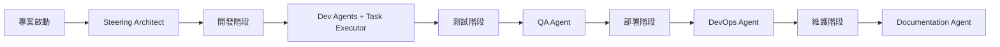
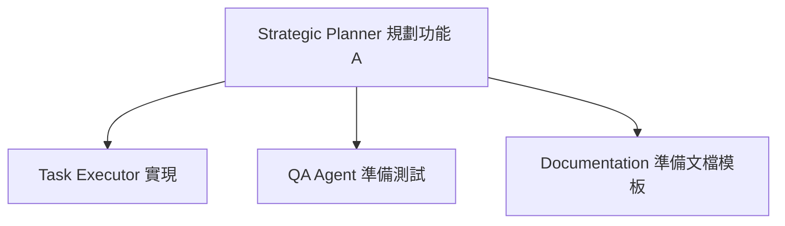
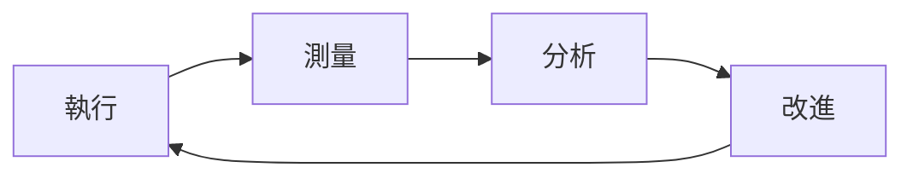

# 🌟 最佳實踐指南

集結使用九大 Agent 系統的經驗和智慧。

## 📋 目錄

1. [Agent 選擇策略](#agent-選擇策略)
2. [專案初始化最佳實踐](#專案初始化最佳實踐)
3. [開發流程優化](#開發流程優化)
4. [常見陷阱與解決方案](#常見陷阱與解決方案)
5. [效率提升技巧](#效率提升技巧)
6. [團隊協作指南](#團隊協作指南)

---

## 🎯 Agent 選擇策略

### 根據專案規模選擇

#### 小型專案（< 10 個功能）
```
推薦配置：最小團隊
- Strategic Planner (規劃)
- Task Executor (執行)
- Base Developer (開發)

原因：保持簡單，避免過度工程
```

#### 中型專案（10-50 個功能）
```
推薦配置：開發團隊 + QA
- Strategic Planner
- Task Executor
- 領域 Developer (Flutter/Web)
- Quality Assurance

原因：需要品質保證，但不需要複雜運維
```

#### 大型專案（> 50 個功能）
```
推薦配置：完整團隊
- 所有 9 個 Agent

原因：需要完整的開發生命週期支援
```

### 根據專案階段調整



---

## 🚀 專案初始化最佳實踐

### 1. 明確定義再開始

**❌ 錯誤做法**
```
直接開始寫代碼
```

**✅ 正確做法**
```
1. 使用 Steering Architect 定義架構
2. 明確產品願景和技術選型
3. 建立清晰的專案結構
```

### 2. 循序漸進的 Agent 啟用

**第一週**：基礎配置
- Steering Architect (架構)
- Strategic Planner (規劃)
- Task Executor (執行)

**第二週**：加入開發支援
- 領域特定 Developer Agent

**第三週**：完善流程
- Quality Assurance
- Documentation

**成熟期**：全面自動化
- DevOps Agent

### 3. 文檔先行

```yaml
優先級:
  1: .ai-rules/ (架構文檔)
  2: CLAUDE.md (AI 配置)
  3: specs/ (功能規格)
  4: 代碼實現
```

---

## 💻 開發流程優化

### 1. 規格驅動開發 (Spec-Driven Development)

```
需求 → Strategic Planner → specs/
                ↓
         詳細設計文檔
                ↓
      Task Executor → 逐步實現
```

**優點**：
- 減少返工
- 清晰的實現路徑
- 易於追蹤進度

### 2. 任務粒度控制

**✅ 好的任務粒度**
```markdown
- [ ] 1. 創建 User 模型
  - [ ] 1.1 定義資料表結構
  - [ ] 1.2 添加必要索引
  - [ ] 1.3 創建 migration
```

**❌ 過大的任務**
```markdown
- [ ] 1. 實現用戶系統
```

### 3. 持續驗證策略

```yaml
每個任務完成後:
  1. Task Executor 自我驗證
  2. QA Agent 自動測試
  3. 用戶確認（如需要）
  
好處:
  - 及早發現問題
  - 保持高品質
  - 減少技術債
```

---

## ⚠️ 常見陷阱與解決方案

### 陷阱 1：Agent 職責混淆

**問題**：讓 Strategic Planner 寫代碼
**解決**：嚴格遵守 Agent 職責劃分

```
Strategic Planner → 只做規劃
Task Executor → 只做執行
Dev Agents → 只做專業開發
```

### 陷阱 2：過度規劃

**問題**：花太多時間在規劃，遲遲不開始實現
**解決**：採用迭代方式

```
1. 快速規劃核心功能 (1-2 小時)
2. 開始實現
3. 邊做邊調整
```

### 陷阱 3：忽視測試

**問題**：功能完成才想到測試
**解決**：測試驅動開發

```yaml
工作流程:
  1. QA Agent 先寫測試
  2. Task Executor 實現功能
  3. 確保測試通過
```

### 陷阱 4：文檔滯後

**問題**：代碼完成很久，文檔還沒更新
**解決**：同步更新機制

```
每個 Sprint 結束:
  - Documentation Agent 審查變更
  - 自動更新 API 文檔
  - 更新用戶指南
```

---

## 🚄 效率提升技巧

### 1. 批量任務執行

**場景**：有 20 個類似的 CRUD 操作要實現

```bash
# 使用 Task Executor 的自主模式
"continue tasks by yourself"

# Agent 會連續執行所有任務
```

### 2. 模板重用

**創建專案模板庫**
```
templates/
├── crud-operations/
├── auth-system/
├── payment-integration/
└── admin-panel/
```

### 3. Agent 預設配置

**為常見場景創建預設組合**
```yaml
presets:
  startup:
    agents: [strategic-planner, task-executor, base-developer]
  
  enterprise:
    agents: [all]
    
  mobile:
    agents: [strategic-planner, task-executor, flutter-developer, qa]
```

### 4. 平行工作



---

## 👥 團隊協作指南

### 1. Agent 分工模式

**單人開發**
```
開發者 + 全部 Agent = 超級生產力
```

**小團隊（2-5 人）**
```
- 產品經理 → 使用 Strategic Planner
- 開發者 → 使用 Task Executor + Dev Agents
- 測試人員 → 使用 QA Agent
```

**大團隊（> 5 人）**
```
- 架構師 → Steering Architect
- 需求分析師 → Strategic Planner
- 開發團隊 → Task Executor + Dev Agents
- QA 團隊 → Quality Assurance
- DevOps → DevOps Agent
- 技術寫手 → Documentation
```

### 2. 溝通協議

**使用統一的文檔體系**
```
.ai-rules/ → 所有人都要讀
specs/ → 開發前必讀
validation-scripts/ → CI/CD 整合
```

**定期同步會議**
```yaml
每日站會:
  - Task Executor 進度
  - 遇到的問題
  
週會:
  - Strategic Planner 新規劃
  - QA Agent 品質報告
  
月會:
  - Steering Architect 架構審查
```

### 3. 知識管理

**持續更新知識庫**
```
DEVELOPMENT_KNOWLEDGE_BASE.md
├── 技術決策記錄
├── 問題解決方案
├── 性能優化經驗
└── 架構演進歷史
```

---

## 📊 度量和改進

### 關鍵指標

```yaml
效率指標:
  - 任務完成速度
  - 代碼品質分數
  - 測試覆蓋率
  - 文檔完整度
  
品質指標:
  - Bug 密度
  - 技術債務
  - 性能指標
  - 安全評分
```

### 持續改進循環



---

## 🎓 進階技巧

### 1. 自定義 Agent 行為

```yaml
# 在 .claude/agents/custom-rules.yaml
custom_behaviors:
  code_style: "always_use_typescript"
  testing: "tdd_mandatory"
  documentation: "inline_comments_required"
```

### 2. Agent 串聯工作流

```python
# 定義複雜工作流
workflow = [
    ("Strategic Planner", "create_spec"),
    ("Task Executor", "implement_backend"),
    ("Flutter Developer", "implement_ui"),
    ("QA Agent", "test_integration"),
    ("DevOps Agent", "deploy_staging"),
    ("Documentation", "update_docs")
]
```

### 3. 智能 Agent 選擇

```javascript
function selectAgents(projectType, teamSize, deadline) {
    if (deadline < 7) {
        return ["task-executor", "base-developer"]; // 快速模式
    }
    if (teamSize > 5) {
        return ALL_AGENTS; // 完整團隊
    }
    // 更多邏輯...
}
```

---

## 🏁 總結

### 核心原則

1. **明確分工**：每個 Agent 做自己最擅長的事
2. **持續溝通**：保持資訊在 Agent 間流動
3. **迭代改進**：從簡單開始，逐步完善
4. **品質優先**：寧可慢一點，也要做對
5. **知識積累**：記錄經驗，避免重複踩坑

### 成功公式

```
清晰的架構 (Steering Architect)
    + 
詳細的規劃 (Strategic Planner)
    + 
精確的執行 (Task Executor)
    + 
專業的實現 (Dev Agents)
    + 
嚴格的測試 (QA Agent)
    + 
自動化部署 (DevOps)
    + 
完善的文檔 (Documentation)
    = 
🎉 高品質的軟體專案
```

---

*持續更新中... 歡迎貢獻您的最佳實踐！*