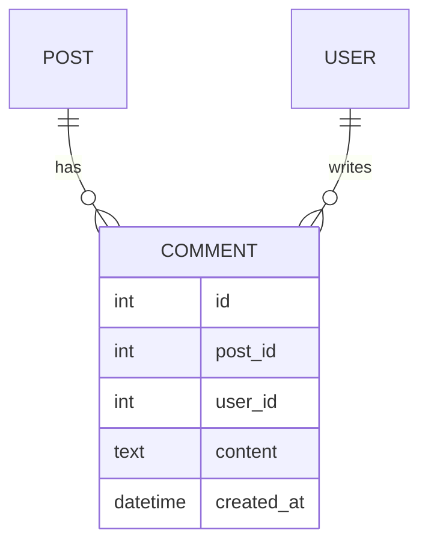

# 📘 工作流程範例

通過實際案例學習如何使用九大 Agent 系統。

## 📋 目錄

1. [電商網站從零開始](#電商網站從零開始)
2. [Flutter 記帳 App 開發](#flutter-記帳-app-開發)
3. [現有專案添加新功能](#現有專案添加新功能)
4. [緊急 Bug 修復流程](#緊急-bug-修復流程)
5. [微服務架構專案](#微服務架構專案)

---

## 🛒 電商網站從零開始

### 專案背景
創建一個小型電商網站，包含商品展示、購物車、結帳功能。

### Step 1: 初始化專案
```bash
./tools/init-project.sh
```

選擇：
- 專案名稱: `mini-shop`
- 專案類型: Web 應用
- 語言: JavaScript/TypeScript  
- Agent: A) 完整團隊

### Step 2: Steering Architect 定義架構

**.ai-rules/product.md**
```markdown
# Mini Shop 產品願景

## 核心目的
提供簡單易用的線上購物平台

## 目標用戶
- 小型商家
- 個人買家

## 主要功能
- 商品瀏覽
- 購物車管理
- 安全結帳
- 訂單追蹤
```

**.ai-rules/tech.md**
```markdown
# 技術棧

## 前端
- React 18
- TypeScript
- Tailwind CSS

## 後端
- Node.js + Express
- PostgreSQL
- Redis (快取)

## 部署
- Docker
- AWS EC2
```

### Step 3: Strategic Planner 規劃用戶系統

創建 `specs/user-auth/requirements.md`:
```markdown
# 用戶認證需求

## 用戶故事
作為買家，我需要註冊和登入，以便追蹤我的訂單。

## 驗收標準
- WHEN 用戶提供有效 email 和密碼 THEN 系統創建新帳戶
- WHEN 用戶輸入正確憑證 THEN 系統允許登入
- WHEN 用戶忘記密碼 THEN 系統發送重設連結
```

### Step 4: Task Executor 實現功能

**tasks.md**:
```markdown
# Plan: user-auth

## Tasks
- [x] 1. 創建 User 資料表結構
  - [x] 1.1 定義 schema
  - [x] 1.2 創建 migration
- [x] 2. 實現註冊 API
  - [x] 2.1 創建 /api/auth/register 端點
  - [x] 2.2 添加輸入驗證
  - [x] 2.3 密碼加密
- [ ] 3. 實現登入 API
  - [ ] 3.1 創建 /api/auth/login 端點
  - [ ] 3.2 生成 JWT token
```

### Step 5: QA Agent 添加測試

```javascript
// tests/auth.test.js
describe('User Authentication', () => {
  test('should register new user', async () => {
    const response = await request(app)
      .post('/api/auth/register')
      .send({
        email: 'test@example.com',
        password: 'SecurePass123'
      });
    
    expect(response.status).toBe(201);
    expect(response.body).toHaveProperty('userId');
  });
});
```

### Step 6: DevOps Agent 設置部署

**docker-compose.yml**:
```yaml
version: '3.8'
services:
  web:
    build: .
    ports:
      - "3000:3000"
    environment:
      - NODE_ENV=production
    depends_on:
      - db
      - redis
  
  db:
    image: postgres:14
    environment:
      POSTGRES_DB: minishop
  
  redis:
    image: redis:7
```

### Step 7: Documentation Agent 生成文檔

**docs/api-reference.md**:
```markdown
# API 參考

## 認證端點

### POST /api/auth/register
創建新用戶帳戶

**請求體:**
```json
{
  "email": "user@example.com",
  "password": "securepassword"
}
```

**回應:**
```json
{
  "userId": "123",
  "email": "user@example.com"
}
```
```

---

## 📱 Flutter 記帳 App 開發

### 專案背景
開發一個個人記帳 App，支援收支記錄、分類統計。

### Step 1: 初始化
```bash
./tools/init-project.sh
```

選擇：
- 專案名稱: `money-tracker`
- 專案類型: Flutter 應用
- Agent: 2,3,4,7 (規劃、執行、Flutter、測試)

### Step 2: Strategic Planner 設計核心功能

**specs/expense-tracking/requirements.md**:
```markdown
# 支出追蹤需求

## 用戶故事
作為用戶，我想要記錄每日支出，以便了解消費習慣。

## 功能需求
1. 添加支出記錄
2. 選擇支出類別
3. 查看月度統計
4. 匯出報表
```

### Step 3: Flutter Developer 實現 UI

```dart
// lib/screens/add_expense_screen.dart
class AddExpenseScreen extends StatefulWidget {
  @override
  _AddExpenseScreenState createState() => _AddExpenseScreenState();
}

class _AddExpenseScreenState extends State<AddExpenseScreen> {
  final _formKey = GlobalKey<FormState>();
  final _amountController = TextEditingController();
  
  @override
  Widget build(BuildContext context) {
    return Scaffold(
      appBar: AppBar(
        title: Text(AppLocalizations.of(context).addExpense),
      ),
      body: Form(
        key: _formKey,
        child: Column(
          children: [
            TextFormField(
              controller: _amountController,
              keyboardType: TextInputType.number,
              decoration: InputDecoration(
                labelText: AppLocalizations.of(context).amount,
              ),
            ),
            // 更多欄位...
          ],
        ),
      ),
    );
  }
}
```

### Step 4: 編譯和測試

```bash
# Flutter Developer 預設編譯命令
flutter build apk --release --target-platform=android-arm64 --split-per-abi

# QA Agent 執行測試
flutter test
flutter drive --target=test_driver/app.dart
```

---

## 🔧 現有專案添加新功能

### 場景
在現有的部落格系統中添加評論功能。

### Step 1: 分析現有專案
```bash
./tools/analyze-project.sh /path/to/blog-system
```

### Step 2: Strategic Planner 規劃評論系統

**specs/comment-system/design.md**:
```markdown
# 評論系統設計

## 資料模型


## API 設計
- GET /api/posts/{id}/comments
- POST /api/posts/{id}/comments
- DELETE /api/comments/{id}
```

### Step 3: 協調多個 Agent 實現

1. **Task Executor**: 創建資料表
2. **Web Developer**: 實現前端評論元件
3. **Base Developer**: 實現後端 API
4. **QA Agent**: 添加評論測試
5. **Documentation**: 更新 API 文檔

---

## 🚨 緊急 Bug 修復流程

### 場景
生產環境發現支付功能異常。

### 快速響應流程

1. **QA Agent 定位問題**
```bash
# 執行診斷測試
npm run test:payment -- --debug

# 發現問題：支付 API 超時
```

2. **Task Executor 緊急修復**
```javascript
// 修復前
const response = await paymentAPI.process(data);

// 修復後
const response = await paymentAPI.process(data, {
  timeout: 30000, // 增加超時時間
  retries: 3      // 添加重試機制
});
```

3. **QA Agent 驗證修復**
```bash
# 執行回歸測試
npm run test:regression

# 執行性能測試
npm run test:performance
```

4. **DevOps Agent 緊急部署**
```bash
# 使用熱修復部署
./deploy.sh hotfix --skip-migrations
```

5. **Documentation Agent 記錄事件**
更新 `INCIDENT_LOG.md` 和已知問題列表。

---

## 🏗️ 微服務架構專案

### 專案背景
構建一個微服務架構的訂單管理系統。

### Step 1: Steering Architect 設計架構

**.ai-rules/structure.md**:
```markdown
# 微服務架構

## 服務劃分
- user-service (用戶管理)
- order-service (訂單處理)
- payment-service (支付處理)
- notification-service (通知發送)

## 通訊方式
- REST API (同步)
- RabbitMQ (異步)
- gRPC (內部通訊)
```

### Step 2: Strategic Planner 規劃服務

為每個服務創建獨立的 specs：
```
specs/
├── user-service/
├── order-service/
├── payment-service/
└── notification-service/
```

### Step 3: 多 Agent 並行開發

**並行工作分配：**
- **Web Developer**: 開發 API Gateway
- **Base Developer**: 實現各微服務
- **DevOps Agent**: 設置 Kubernetes
- **QA Agent**: 整合測試

### Step 4: DevOps 編排部署

**kubernetes/deployment.yaml**:
```yaml
apiVersion: apps/v1
kind: Deployment
metadata:
  name: order-service
spec:
  replicas: 3
  selector:
    matchLabels:
      app: order-service
  template:
    metadata:
      labels:
        app: order-service
    spec:
      containers:
      - name: order-service
        image: myapp/order-service:latest
        ports:
        - containerPort: 8080
```

---

## 💡 關鍵要點

### 1. Agent 選擇
- 簡單專案：最小團隊（3個 Agent）
- 複雜專案：完整團隊（9個 Agent）
- 可以隨時增減 Agent

### 2. 協作模式
- 讓 Agent 各司其職
- 保持資訊流通
- 定期同步進度

### 3. 最佳實踐
- 先規劃，後執行
- 持續測試，及早發現問題
- 文檔同步，避免知識斷層

---

*更多最佳實踐請參考 [BEST_PRACTICES.md](./BEST_PRACTICES.md)*